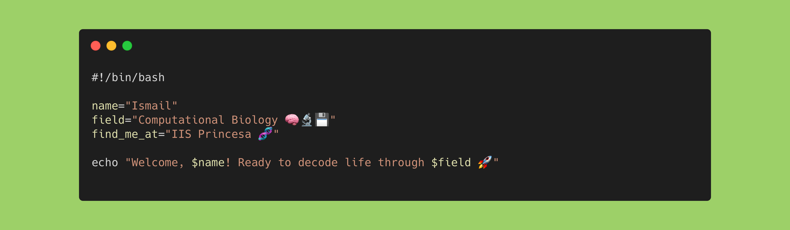

<h1 align="center"> Hello friend, I'm Ismail! 🌱 </h1>

<em>“Errors in the lab can cost you samples, errors in code will cost your weekend...”</em>

   
  

I'm a **Computational Biologist**, passionate about using code to make sense of complex biological systems and human diseases. With a strong foundation in **molecular biology**, **immunology**, and **genomic data analysis**. I combine wet lab experience with programming to approach biology from both ends of the pipette.

 

## 🧬 About Me

I hold a **Bachelor’s degree in Biology** from the University of Alcalá (UAH), where I first discovered my interest in bioinformatics. This curiosity led me to pursue and recently complete a **Master’s in Computational Biology** at the Technical University of Madrid (UPM), where I specialized in:

- 🧬 Genomic data analysis, including comparative genomics and evolutionary biology.
- 📊 Statistical modeling & visualization tools
- 🤖 AI and machine learning in biology
- 💊 Computational tools for drug discovery

Throughout my academic journey, I've balanced hands-on experimentation with rigorous data analysis. My research at the **Instituto de Investigación Sanitaria de la Princesa (IIS Princesa)** includes:

- 🧪 **Bachelor's Thesis**: Focused on immunology research with techniques like **flow cytometry, qPCR, protein quantification, and microscopy**, paired with **statistical analysis in R**.  
- 🧠 **Master’s Thesis**: A **genome-wide association study (GWAS)** on cardiovascular diseases using advanced **statistical and computational genomics** methods.

(📢 I presented part of my work on B cell surface proteins at the **45th SEMI Congress (2024)**).

 

## 🛠️ Tech Skills

| Category                        | Tools & Topics                                                                 |
|--------------------------------|--------------------------------------------------------------------------------|
| **Programming**                | Python, R, Bash                                                                |
| **Genomic Data Analysis**      | QC & preprocessing, Genome assembly, Variant calling, GWAS, RNA-seq, Phylogenetics                |
| **Statistical Modeling**       | Descriptive analysis, Uni & Multivariate analysis, Principal component / Factor / Correspondance analysis, Basic stats               |
| **Machine Learning**           | Supervised and Unsupervised (scikit-learn, PySpark)                                                          |
| **Data Science & FAIR**        | Big Data engineering (PySpark), FAIR data management, SPARQL                              |
| **Structural Bio & Drug Disc.**| Virtual screening, Pharmacophore modeling, QSAR, Docking                      |

 

## 💡 Soft Skills
🚀 Relentless problem-solver – I won’t stop until the challenge is cracked.

🧠 Critical and analytical thinker with a strong scientific mindset.

🔄 Adaptable to both research and computational environments.

🤝 Collaborative and proactive in multidisciplinary teams.

 

## 📚 What’s Next?
I'm now looking forward to starting a PhD, where I aim to further develop computational skills to uncover insights in biology and medicine.
From genotype to phenotype.

 

## 📫 Let’s Connect! 
> 📧 ismail.kirrout@gmail.com

<!--
**ismailkirrout/ismailkirrout** is a ✨ _special_ ✨ repository because its `README.md` (this file) appears on your GitHub profile.

Here are some ideas to get you started:

- 🔭 I’m currently working on ...
- 🌱 I’m currently learning ...
- 👯 I’m looking to collaborate on ...
- 🤔 I’m looking for help with ...
- 💬 Ask me about ...
- 📫 How to reach me: ...
- 😄 Pronouns: ...
- ⚡ Fun fact: ...
-->
